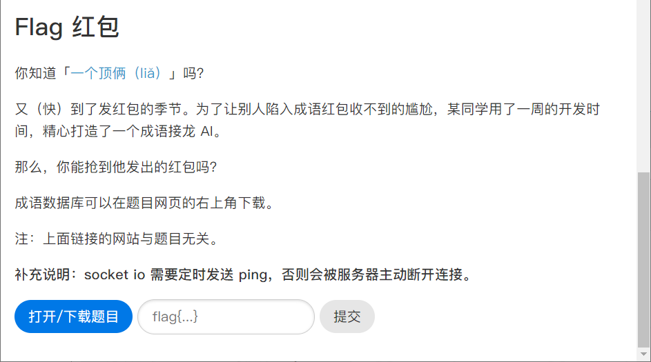

# 成语接龙


> [Hackgame 2019](https://hack.lug.ustc.edu.cn)（中国科学技术大学第六届信息安全大赛）成语接龙题解（暴力算法）。《图论》学得不太好，没想到更好的算法，只能弄出来这么个暴力算法，供参考。

<!-- TOC -->

- [成语接龙](#成语接龙)
    - [运行](#运行)
        - [比赛](#比赛)
        - [非比赛](#非比赛)
    - [思路](#思路)
        - [有向图](#有向图)
        - [`KN`和`SN`集合](#kn和sn集合)
    - [关于本题](#关于本题)

<!-- /TOC -->


## 运行

### 比赛
1. `pip3 install networkx matplotlib "python-socketio[client]"`；
2. `vim config.py`，根据自己的机器修改`WORKER_NUM`的值，它表示运算`S1`,`K2`,`S2`集合（这些集合的定义见下文）时同时使用的进程数，设置计算哪些集合（最好全部为`True`即全部计算，若性能有限，可以不计算`K2`），填入自己的`Token`；
3. `python3 main.py`。


示例如下：

```
# WORKER_NUM = 16
# CAPACITY = [True, True, True, True, True, True]

> python3 main.py


####### omitted #######


Server:  {'data': '乖僻邪谬'}
Round count 27
Success count 2.
k0 []
s0 ['sheng', 'yu', 'kai', 'li', 'chuan']
k1 []
s1 ['kai', 'sheng', 'chuan', 'li', 'yu']
k2 []
s2 ['kai']
k0_list []
k1_list_real []
k2_list_real []
Me      : 谬想天开

Server:  {'data': '开口见心'}
Round count 28
Success count 2.
k0 []
s0 ['de', 'yong', 'zhu', 'yan', 'duan', 'que', 'ruan', 'da', 'fu', 'di', 'lie', 'mi', 'yao', 'zhi', 'ju', 'luan', 'rong', 'sheng', 'huan', 'jiao', 'yuan', 'qie', 'pan', 'luo', 'zhan', 'fa'$ 'lan', 'liao', 'fen', 'chuan', 'ying', 'yu', 'hen', 'qiao', 'hui', 'ma', 'zu', 'zhui', 'shi', 'ding', 'he', 'jing', 'shui', 'hu', 'zheng', 'zhua', 'kuang', 'kuai', 'shu', 'xie', 'xing', '$r', 'qiang', 'bing', 'you', 'ao', 'du', 'la', 'fang', 'tai', 'ce', 'te', 'bai', 'leng', 'zhuan', 'chan', 'han', 'mu', 'xia', 'ning', 'zhuang', 'lu', 'chi', 'ai', 'min', 'nian', 'yin', 'cha$', 'nao', 'rou', 'xiu', 'chu', 'po', 'xuan', 'geng', 'ben', 'jia', 'xin', 'ya', 'gu', 'tiao', 'ye', 'ming', 'tian', 'zhuo', 'rang', 'cui', 'jie', 'gong', 'liang', 'cheng', 'guai', 'liu', '$uo', 'ge', 'jiang', 'dan', 'lai', 'quan', 'mei', 'zhen', 'gao', 'pai', 'xiang', 'sui', 'yang', 'ken', 'cu', 'zao']
k1 []
s1 ['rong', 'sheng', 'huan', 'jiao', 'yuan', 'qie', 'pan', 'luo', 'du', 'la', 'fang', 'tai', 'ce', 'te', 'bai', 'leng', 'he', 'jing', 'shui', 'hu', 'zheng', 'zhua', 'kuang', 'kuai', 'zhuan$, 'chan', 'han', 'mu', 'xia', 'ning', 'zhuang', 'lu', 'hen', 'qiao', 'hui', 'ma', 'zu', 'zhui', 'ding', 'fu', 'di', 'lie', 'mi', 'yao', 'ju', 'luan', 'pai', 'xiang', 'sui', 'yang', 'ken', $cu', 'chi', 'ai', 'min', 'nian', 'yin', 'chao', 'nao', 'rou', 'zhan', 'fa', 'lan', 'liao', 'fen', 'chuan', 'ying', 'yu', 'cui', 'jie', 'gong', 'liang', 'cheng', 'guai', 'cuo', 'xiu', 'chu'$ 'po', 'xuan', 'geng', 'ben', 'jia', 'xin', 'de', 'yong', 'yan', 'duan', 'que', 'ruan', 'da', 'ge', 'jiang', 'dan', 'lai', 'quan', 'mei', 'zhen', 'gao', 'ya', 'gu', 'tiao', 'ye', 'tian', '$huo', 'rang', 'shu', 'xie', 'xing', 'er', 'qiang', 'bing', 'you', 'ao']
k2 []
s2 ['ruan']
k0_list []
k1_list_real []
k2_list_real []
Me      : 心慈手软


####### omitted #######


Server:  {'data': '佩紫怀黄'}
Round count 120
Success count 3.
k0 ['fou']
s0 ['jing', 'chi', 'lu', 'tuan', 'shui', 'ri', 'shu', 'bei', 'sou', 'fu', 'lv', 'jie', 'fan', 'zi', 'meng', 'an', 'shi', 'nong', 'bing', 'mei', 'lun', 'yue', 'yan', 'du', 'zhang', 'tu', 'ti
ao', 'zhao', 'qing', 'dai', 'jian', 'xiang', 'deng', 'yin', 'tong', 'ni', 'ti', 'gai', 'hou', 'gua', 'dian', 'shou', 'run', 'xia', 'chan', 'huan', 'fou']
k1 ['fou']
s1 ['tuan', 'shui', 'ri', 'mei', 'lun', 'an', 'nong', 'jing', 'chi', 'lu', 'shu', 'bei', 'sou', 'fan', 'zi', 'meng', 'zhao', 'dai', 'huan', 'fou', 'zhang', 'tu', 'tiao', 'fu', 'lv', 'run',
'xia', 'chan', 'xiang', 'deng', 'ti', 'gai', 'hou', 'yin', 'tong', 'ni', 'gua', 'dian', 'shou', 'yan', 'du']
k2 ['fou']
s2 ['tuan']
k0_list ['fou']
k1_list_real ['fou']
k2_list_real ['fou']
Me      : 黄锺瓦缶

Server:
Server:  {'data': '成功领取红包! 你已收集 flag 碎片 4/4'}
 {'data': '恭喜你, 你成功获得 flag 红包奖励~'}
Success count 4.

Server:  {'data': 'flag{True_Virtuoso_of_Chinese_Idioms_b46b56ccdb}'}
Found flag, exit!
```

### 非比赛

1. `pip3 install networkx matplotlib "python-socketio[client]"`；
2. `vim config.py`，根据自己的机器修改`WORKER_NUM`的值，它表示运算`S1`,`K2`,`S2`集合（集合的介绍见下）时同时使用的进程数，设置计算哪些集合（`K2`和`S2`计算较费时，可将其设为`False`），忽略`Token`值；
3. `vim play.py`，在最底部一行设置玩家信息，默认值为`play(('Me', 'smart'), ('Robot', 'random'))`，表示名字为`Me`的玩家的运行模式是`smart`，名字为`Robot`的玩家的运行模式是`random`（模式的介绍见下）；
4. `python3 play.py`，输入初始的成语（必须要在`idiom.json`库中），若有选择`manual`模式，需要在每次提示当前可选成语时手动输入其中的一个成语。


示例如下：

```
# play(('Me', 'smart'), ('Robot', 'random'))
# WORKER_NUM = 4
# CAPACITY = [True, True, True, True, False, False]

> python3 play.py
Initial idiom: 废理兴工
Round 1
k0 []
s0 ['di', 'fu', 'she', 'bei', 'chou', 'li', 'jian', 'mai', 'da', 'zhi', 'fei', 'gu', 'kun', 'bian', 'guan', 'e', 'jie', 'ming', 'zhong', 'guo', 'hao', 'er', 'sun', 
'cheng', 'shi', 'ju', 'ku', 'sui', 'tui', 'man', 'liang', 'xia', 'zhu', 'kui', 'gui', 'lu', 'shan', 'zhan', 'que', 'huan', 'suan', 'dan', 'meng', 'ke', 'gou', 'keng', 'qiu', 'jia', 'hu', 'sheng', 'xi', 'zi', 'jing', 'fa', 'zhou', 'xing', 'zu', 'bo', 'cuo', 'xiang', 'hui', 'tiao', 'chi', 'gan']
k1 []
s1 ['kui', 'gui', 'lu', 'shan', 'zhan', 'que', 'huan', 'suan', 'dan', 'meng', 'ke', 'gou', 'keng', 'qiu', 'jia', 'jie', 'zhong', 'guo', 'hao', 'er', 'sun', 'cheng', 'shi', 'ju', 'ku', 'sui', 'tui', 'man', 'liang', 'xia', 'hu', 'sheng', 'xi', 'zi', 'jing', 'fa', 'zhou', 'xing', 'zu', 'bo', 'cuo', 'xiang', 'hui', 'tiao', 'chi', 
'gan', 'di', 'fu', 'she', 'bei', 'chou', 'li', 'jian', 'mai', 'da', 'fei', 'gu', 'kun', 'guan', 'e']
k0_list []
k1_list_real []   
k2_list_real []   
Me      : 功亏一篑
Robot   : 愧不敢当

Round 2
k0 []
s0 ['cai', 'chou', 'duan', 'feng', 'zhu', 'jue', 'shi', 'ye', 'bei', 'mi', 'nian', 'hu', 'guo', 'rang', 'du', 'shuang', 'he', 'mian', 'bang', 'zhong', 'se', 'kui', 
'zhuo', 'nve', 'jian', 'sheng', 'zheng', 'kan', 'lun', 'jia', 'shan', 'po', 'chang', 'cun', 'ju']
k1 []
s1 ['mi', 'nian', 'hu', 'guo', 'rang', 'du', 'shuang', 'he', 'mian', 'kan', 'lun', 'jia', 'shan', 'po', 'chang', 'cun', 'ju', 'bang', 'zhong', 'se', 'kui', 'zhuo', 
'nve', 'jian', 'sheng', 'zheng', 'cai', 'chou', 'duan', 'feng', 'jue', 'shi', 'ye', 'bei']
k0_list []
k1_list_real []
k2_list_real []
Me      : 当局者迷
Robot   : 靡衣玉食


####### omitted #######


Round 8
k0 ['fou']
s0 ['sheng', 'zhong', 'de', 'kong', 'shi', 'rang', 'ju', 'gu', 'shu', 'tian', 'za', 'mu', 'zhi', 'qin', 'yu', 'qu', 'jian', 'xin', 'duan', 'xiong', 'fen', 'fei', 'xing', 'ce', 'feng', 'ming', 'cui', 'qing', 'xiang', 'liu', 'nu', 'zi', 'gou', 'xiu', 'lao', 'fu', 'lang', 'tou', 'yuan', 'lu', 'meng', 'sang', 'xie', 'po', 'zai', 'xi', 'kuai', 'san', 'mian', 'gui', 'bei', 'mi', 'ze', 'fan', 'bai', 'hun', 'yun', 'hu', 'long', 'e', 'zhu', 'li', 'quan', 'guan', 'zhan', 'zheng', 'su', 'wen', 'bo', 'pu', 'bing', 'shan', 'jie', 'zong', 'ran', 'neng', 'you', 'ge', 'kuo', 'an', 'chu', 'shao', 'zu', 'jiao', 'luan', 'tang', 'ling', 'cai', 'fa', 'huan', 'hua', 'guo', 'qian', 'yang', 'du', 'wan', 'zhuang', 'nuan', 'tai', 'chang', 'hai', 'fou']
k1 ['fou']
s1 ['kuo', 'an', 'chu', 'shao', 'zu', 'jiao', 'luan', 'tang', 'ling', 'cai', 'fa', 'huan', 'hua', 'guo', 'qian', 'yang', 'du', 'wan', 'zhuang', 'nuan', 'tai', 'chang', 'hai', 'fou', 'cui', 'qing', 'xiang', 'nu', 'zi', 'gou', 'xiu', 'lao', 'fu', 'lang', 'tou', 'yuan', 'lu', 'meng', 'sang', 'xie', 'po', 'zai', 'xi', 'kuai', 'san', 'mian', 'bei', 'mi', 'ze', 'fan', 'bai', 'hun', 'hu', 'long', 'e', 'zhu', 'li', 'quan', 'guan', 'zhan', 'zheng', 'su', 'wen', 'bo', 'pu', 'shan', 'jie', 'zong', 
'ran', 'neng', 'you', 'ge', 'sheng', 'zhong', 'de', 'kong', 'shi', 'rang', 'ju', 'gu', 'shu', 'tian', 'za', 'mu', 'qin', 'yu', 'qu', 'jian', 'xin', 'duan', 'xiong', 'fen', 'fei', 'xing', 'ce', 'ming']
k0_list ['fou']
k1_list_real ['fou']
k2_list_real []
Me      : 人涉卬否
No available choice for fou
Robot Lost!
```

## 思路

### 有向图

所用的所有成语在`idiom.json`中，每个成语有`first`和`last`属性，表示成语开头和结尾的拼音。建立一个有向图（因为不能排除有环，所以不是 DAG），将出现的所有开头和结尾的拼音作为结点，所有成语作为有向边，从成语的`first`对应的结点指向`last`对应的结点。由于不同的成语可能有相同的`first`和`last`（如成语库中的`弃短就长`和`弃短用长`），所以两个节点之间可以有多条有向边。

定义`current`变量为当前玩家要接的词的词尾拼音。服务器发来的第一个成语总是`废理兴工`，所以我们关注`gong`这个结点，并把`current`变量定义为它，我们找以它为起点的有向边（我们找到了`工力悉敌`, `弓调马服`等），如果我们要选择接`工力悉敌`，那么`current`变为`di`，服务器接，发来一个新成语，我们再取新成语的词尾拼音赋给`current`......

可以看到，玩成语接龙的最核心的部分就是根据对手发来的成语的词尾拼音（即`current`的值）确定我们要选哪一个拼音作为新的`current`的值，然后任意取从旧`current`结点到新`current`结点的一条边所对应的成语即可。脚本中`Player`类的`choose(self, graph, current)`方法就是做这件事。

`choose()`方法有三种运行模式：`manual`, `random`, `smart`，分别表示提示可选成语并让你手动选择、从可选成语里面随机选择、使用暴力算法获得较优选择，最后一种模式就是在和服务器比赛时所用的模式，也是脚本的核心。

### `KN`和`SN`集合

`smart`模式需要计算几个集合（`S0`,`K0`,`S1`, `K1`,`S2`,`K2`...），根据这些集合确定这次要使用的成语的词尾。

先做约定：服务器发来一个词后，我们的选择和紧接着服务器的选择是当前回合。

回顾上文，我们在接服务器发来的`废理兴工`时，如果发现有两个选择：`工力悉敌`, `弓调马服`，即当前`current`为` gong`下新`current`的值有 `di`和`fu`两个选择，而如果我们发现结点`di`的 outdegree（出度，即从该节点出射的边数）为 0，那么就意味着我们如果选了`di`作为`current`，那么服务器就没有成语可接。于是，我们把`di`放入`K0`集合，`K`表示`Kill`，`0`表示能在接下来零回合（即当前回合）杀死对方。

如果我们发现没有这样的可以当前回合就杀死对方的拼音，既然杀不死，我们就要想怎么防止被对方杀死，这个时候我们在当前所有可选结点里面找，如果其中一个结点`x`满足：不管对方选择`x`的哪一个后继，那个后继的 outdegree 都不为 0，即只要我们选了`x`，不管对方选了什么，我们都不会死。于是，我们把结点`x`放入`S0`集合，`S`表示`Safe`，`0`表示在接下来零回合内（即当前回合）一定安全。

类似地`K1`表示一定能在接下来一回合杀死对方，`S1`表示在接下来一回合一定安全，`S2`...

具体规则如下：

```
Abbreviation:
X.od = X.outdegree()
X.s = X.successors()

X ∈ K0 if X.od = 0
X ∈ S0 if X.∀s.od != 0
X ∈ K1 if X.∀s.∃s.od = 0
X ∈ S1 if X.∀s.∃s.∀s.od != 0
X ∈ K2 if X.∀s.∃s.∀s.∃s.od = 0
X ∈ S2 if X.∀s.∃s.∀s.∃s.∀s.od != 0
......
```

递归定义：

```
Abbreviation:
X.od = X.outdegree()
X.s = X.successors()

X ∈ K0 if X.od = 0
X ∈ S0 if X.∀s.od != 0

X ∈ K(n) if X.∀s.∃s ∈ K(n-1) (n>0)
X ∈ S(n) if X.∀s.∃s ∈ S(n-1) (n>0)
......
```

代码：

```
def kill(level, x, graph):
    '''
    return True if x ∈ Kn (level means n)
    for example,
    if kill(0, x, graph) == True, then add x to K0
    '''
    if level == 0:
        return graph.out_degree(x) == 0
    else:
        for p in graph.successors(x):
            exist = False
            for q in graph.successors(p):
                if kill(level -1, q, graph):
                    exist = True
                    break
            if exist == False:
                return False
        return True

def safe(level, x, graph):
	......
```

> 在以上所有叙述中，省略了删除某条边、之后再加上那条边的过程（因为游戏规则不允许使用用过的成语，所以选择一个成语后必须要删除对应的边）。

在此暴力算法下，只要机器性能足够厉害，`Kn`和`Sn`算得越多越好，但是在和服务器比赛的时候发现，算到 n = 2 比较合适：一方面 n = 2 时我们的暴力计算不需要花费太长时间，另一方面胜率能够得到保证（个人测试大概在 90% 左右）。

得到`S0`,`K0`,`S1`, `K1`,`S2`,`K2`之后，优先在`K0`中找新`current`的值，表示可以当前回合杀死对方；如果其为空，那么在`S0`和`K1`的交集中找，表示能在下一回合杀死对方；如果又为空，那么在`S1`和`K2`的交集中找，表示能在当前回合往后第二个回合杀死对方；如果又为空，说明我们不能在两回合内杀死对方，只好自保，就先在`S2`中找，表示一定可以活两个回合；若为空在`S1`中找，说明一定可以活一个回合；为空则在`S0`中找，说明一定可以活过当前回合。当然，根据`Sn`的定义，如果说`Sn = [ ]`，那么就意味着对手一定存在某种策略使得不管我们怎么做选择，都会在从当前往后第 n 回合被杀死，所以只要对手足够聪明、不失误，我们就必输了。`Kn`同理，如果`x`在`Kn`中，我们一定可以不管对手怎么做选择，在第 n 回合杀死 TA。

另外，由于我们算到 n = 2，所以`S2`和`K2`都只需要获得一个结果即可。具体在程序中，将当前所有可选的结点平均分配到多个进程来计算，只要有任意一个进程算出来一个符合条件的结点，即可直接结束其它所有进程。

> 在和服务器比赛中，每次我都要算几秒才能得到本次相对较优选择，但是我选择完之后服务器秒出，说明服务器的算法一定更优秀，赛后学习下。（这个仓库也会在赛后 Make public）

## 关于本题

> ### 中国科学技术大学第六届信息安全大赛
>
> #### 活动介绍
>
> 2019 年度中国科学技术大学第六届信息安全竞赛即将开幕，科大信息安全大赛自 2014 年起已经连续举办五届，往届比赛均顺利举行，规模盛大，影响甚广。今年我们邀请了更多参赛高校，我们会延续往届的传统，**努力结合我校特色，坚持向新生倾斜的原则，控制题目难度梯度，强调引导和教育作用**，希望能给来自各个学校的参赛选手良好的比赛体验！

这一题名为`Flag 红包`，需要和服务器玩成语接龙，连赢四次可获得 Flag。必须使用成语库中的成语，网站提供成语库的下载，即本仓库的`idiom.json`。




